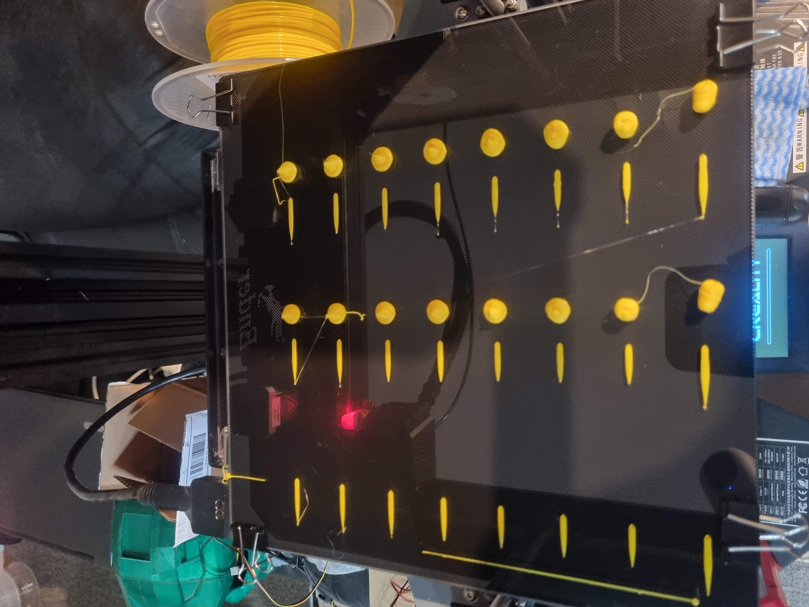

this folder contains files i used to benchmark my ender-7 using the benchmark test created by cnc kitchen

Links to resources
- https://www.cnckitchen.com/blog/extrusion-system-benchmark-tool-for-fast-prints
- https://github.com/CNCKitchen/ExtrusionSystemBenchmark
- https://hotend-flow-tester.netlify.app/

## Pictures
###### Ender-7 Benchmark Results 2023-07-05

20230705 3DBenchy 40min (Top/Bottom Layers,3)(Perminiters,2)(Infill,10%)

