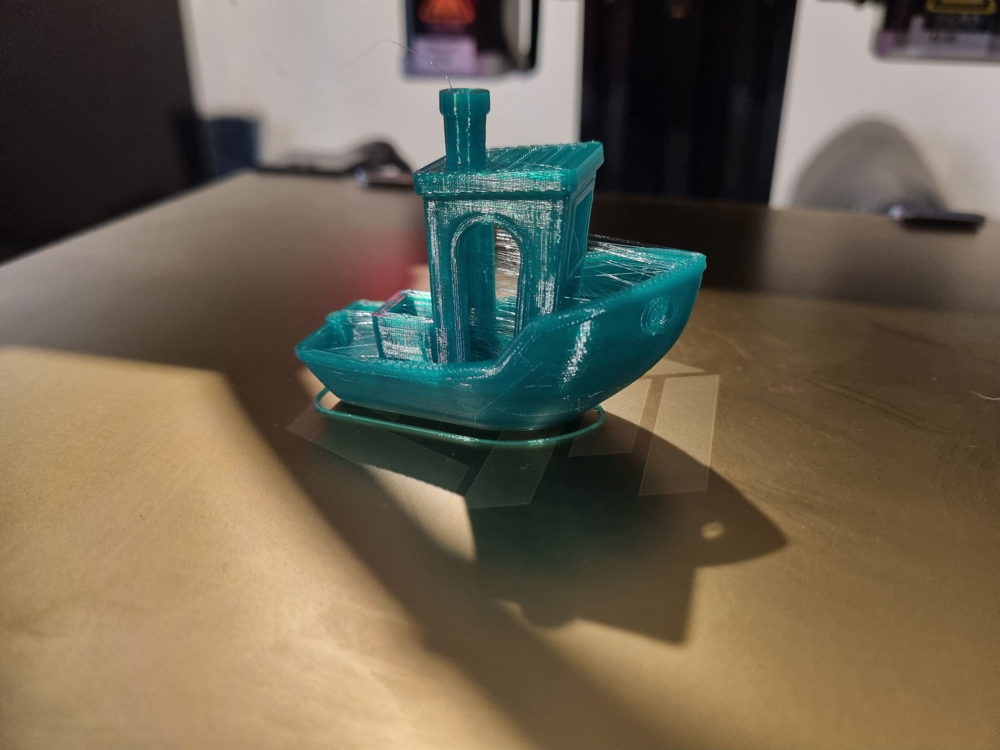

###### Max Extrusion Test 80mm/s to 250mm/s

##### Ender-7 ADXL345 Mount

###### Kilpper First Benchy 21/01/23 (2h 22m) (PrusaSlicer Base Ender 7 settings) 

###### Benchy 23/01/23 (1h 32m)

###### Benchy 24/01/23 (1h 20m)

